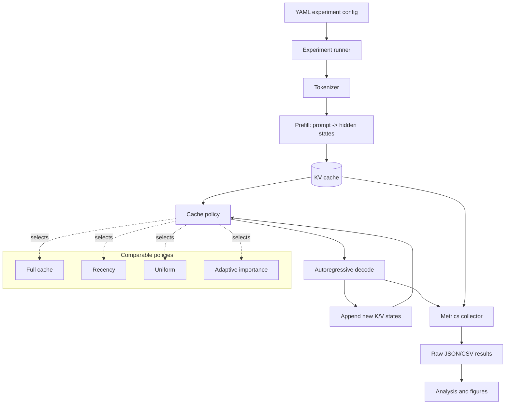
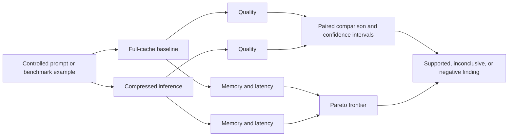

<div align="center">

# Adaptive KV-Cache Compression

### Adaptive memory allocation for efficient long-context Transformer inference

This project investigates whether a Transformer can dynamically decide which
past representations to retain, compress, or discard during autoregressive
inference while preserving language-model and long-context performance.

The research question is not *"can KV-cache compression save memory?"* It is:

> **Can adaptive allocation of KV-cache capacity provide a better
> quality-efficiency trade-off than fixed or recency-based compression under
> the same memory budget?**

<br />


**Status:** research planning and design stage · implementation and results not yet reported

</div>

---

## 📌 Overview

During autoregressive decoding, a Transformer stores keys and values for past
tokens so that every new token can attend to previous context without
recomputing the entire sequence. This KV cache grows with sequence length and
can become a major memory and bandwidth bottleneck for long-context inference.

The project will compare four families of cache policy:

| Policy | Description |
|---|---|
| **Full cache** | Retain every key and value; the reference condition. |
| **Recency** | Retain the most recent tokens under a fixed budget. |
| **Uniform** | Retain tokens using a fixed, non-adaptive allocation. |
| **Adaptive** | Allocate capacity using measurable token, layer, and head signals. |

The study is explicitly allowed to produce a negative result. The primary
hypothesis is:

> **H1:** At equivalent cache budgets, adaptive retention improves the
> quality-memory-latency frontier over fixed or purely recency-based policies.

The null hypothesis is:

> **H0:** Adaptive importance-based compression provides no statistically
> meaningful advantage over simpler policies under equivalent budgets.

No method will be described as novel, state of the art, or generally useful
unless the literature review and experiments support that claim.

## 🎯 Research objectives

1. Derive and empirically verify how KV-cache memory scales with layers, KV
	 heads, sequence length, head dimension, and precision.
2. Determine whether cached tokens have unequal future utility across positions,
	 layers, and attention heads.
3. Compare full, recency, uniform, and importance-based policies at equal
	 memory budgets.
4. Test whether adaptive allocation improves quality without hiding latency or
	 selection overhead.
5. Use ablations to identify whether attention, recency, frequency, or their
	 combinations actually matter.
6. Identify failure cases involving long-range dependencies, rare facts,
	 repeated information, and multi-hop reasoning.
7. Test generalization across context lengths, tasks, compression ratios, and,
	 where feasible, a second small causal model.

## 🧪 Research design

Every claim is tied to an experiment, every experiment has a baseline, and all
comparisons use equivalent cache budgets. Development settings are separated
from final evaluation settings, random seeds are recorded, raw outputs are
preserved, and figures are generated from saved results rather than manually
transcribed numbers.

### Planned budget sweep

```text
100% · 75% · 50% · 25% · 10%
```

### Planned context sweep

```text
2K · 4K · 8K · 16K · 32K
```

The actual range will be constrained by the selected model, hardware, and
measurement validity. The first implementation uses one small openly available
causal model before adding scale.

### Primary measurements

| Category | Metrics |
|---|---|
| Memory | Analytical KV bytes, allocated GPU memory, peak GPU memory |
| Runtime | Prefill latency, decode latency, total latency, tokens/second |
| Language modelling | Next-token loss and perplexity |
| Long context | Retrieval accuracy, multi-needle accuracy, task score |
| Statistics | Mean, median, standard deviation, bootstrap confidence intervals, effect size |
| Reproducibility | Seed, model revision, dtype, hardware, software versions, config |

The main result should be a quality-memory-latency Pareto frontier, not one
unqualified scalar score.

## 🏗️ Architecture



The policy boundary is the central experimental boundary. Model loading,
tokenization, prompts, budgets, decoding settings, and metrics must remain
matched when policies are compared.

### KV-cache memory model

For a standard key-value cache, the analytical estimate is:

```text
KV bytes = 2 × layers × KV heads × sequence length × head dimension × bytes per element
```

The factor of two accounts for keys and values. For grouped-query or
multi-query attention, the number of KV heads can be smaller than the number
of query heads. The estimate will be checked against actual tensors and GPU
memory measurements rather than treated as a complete runtime model.

### Research data flow



## 🧱 Technical stack

### Languages

- **Python 3.11+** for models, experiments, evaluation, analysis, and figures.
- **YAML/JSON** for experiment configuration and machine-readable outputs.
- **Markdown** for research notes, methods, and reproducibility documentation.

### Core ML and numerical tools

- **PyTorch** for tensor operations, inference, cache manipulation, and GPU
	measurement.
- **Hugging Face Transformers** for openly available causal language models,
	tokenization, and comparison with standard generation.
- **Hugging Face Datasets** where a dataset-backed evaluation is appropriate.
- **NumPy and Pandas** for result processing.
- **SciPy** for bootstrap intervals and proportionate statistical tests.
- **Matplotlib** for reproducible research figures.

### Experiment and engineering tools

- YAML configuration files for every run.
- Git for versioned code, configs, and research decisions.
- Local JSON/CSV results as the default tracker; Weights & Biases may be added
	if it reduces, rather than increases, reproducibility friction.
- Optional CUDA GPU execution with CPU support for smoke tests and analytical
	components.

This project intentionally does not introduce Kubernetes, Terraform, FastAPI,
LangChain, Neo4j, or Qdrant. Those technologies belong to other projects in
the portfolio and are not needed for this research question.

## 📂 Target repository structure

The repository currently contains the project documentation and contribution
policies. The following is the intended structure as implementation proceeds;
entries marked planned are not yet present.

```text
configs/
	baseline.yaml              Reproducible baseline configuration

src/
	models/                    Model loading and KV-cache accounting
	cache/                     Cache interfaces and policies (planned)
	compression/               Compression implementations (planned)
	importance/                Attention, recency, and frequency signals (planned)
	evaluation/                Inference and benchmark measurement code
	utils/                     Configuration and reproducibility helpers

experiments/
	baseline/                  Baseline measurements
	importance/                Importance analysis
	compression/               Policy comparisons
	ablations/                 Signal and allocation ablations
	generalization/            Models, tasks, and context-length transfer

scripts/                     Reproducible command-line entry points
results/                     Raw generated outputs
figures/                     Generated plots and paper figures
paper/                       Manuscript, figures, and references (planned)
phases.md                    Ten-phase research and implementation plan

README.md                    Project overview and reproducibility contract
requirements.txt             Python dependencies (planned)
environment.yml              Conda environment specification (planned)
pyproject.toml               Python package metadata (planned)
```

## ⚡ Implementation quick start

There is no runnable inference harness in the repository yet. The first
implementation milestone will add the Python package, baseline configuration,
and `scripts/run_baseline.py`. Once those files exist, the intended setup is:

```bash
python3 -m venv .venv
source .venv/bin/activate
python3 -m pip install -r requirements.txt
PYTHONPATH=. python3 scripts/run_baseline.py --config configs/baseline.yaml
```

The planned baseline will record prompt length, generated length, prefill and
decode time, decode throughput, estimated KV-cache bytes, device, and peak GPU
memory when CUDA is available. Generated results will belong in `results/` and
will not be hand-edited.

## 🔬 Experiments

The experiment sequence is documented in [phases.md](phases.md). In brief:

1. Literature review and gap definition.
2. Full-cache inference harness.
3. Analytical and empirical memory scaling.
4. Attention and token-importance analysis.
5. Fixed compression baselines.
6. First importance-based adaptive policy.
7. Layer and head adaptive allocation.
8. Main quality-efficiency benchmark.
9. Ablations and failure analysis.
10. Generalization, statistical synthesis, and paper release.

### Evaluation controls

- Use the same model revision, prompt set, dtype, decoding parameters, and
	generated-token budget when comparing policies.
- Tune thresholds and weights on development data only.
- Freeze the final evaluation protocol before running the primary comparison.
- Report selection overhead; a policy that saves memory but costs more latency
	must be described that way.
- Preserve raw per-example results, not only aggregate tables.
- Report negative results and cases where a simple baseline wins.

## 🧪 Testing and validation

Testing is layered because this is both a research codebase and a numerical
measurement project.

### Planned fast checks

```bash
python3 -m compileall -q src scripts
PYTHONPATH=. python3 scripts/run_baseline.py --help
git diff --check
```

### Planned unit tests

- KV-cache byte calculations across MHA, GQA, and MQA configurations.
- Cache index selection for full, recency, uniform, and adaptive policies.
- Budget accounting and exact retention counts.
- Stable normalization of importance signals.
- Configuration validation and seed propagation.
- Result schema validation.

### Planned integration tests

- Compare baseline logits or generated output with standard Transformers
	generation under deterministic settings.
- Verify that compressed cache shapes remain valid through multiple decode
	steps.
- Verify that no policy exceeds its configured budget.
- Run a tiny local model on a short synthetic prompt end to end.
- Recreate a figure from raw results in a clean environment.

GPU benchmarks are not unit tests. They will be run as recorded experiments
with hardware, software versions, seeds, and wall-clock conditions stored in
the result metadata.

## 📚 Documentation map

| Document | Purpose |
|---|---|
| [phases.md](phases.md) | Ten-phase plan, deliverables, experiments, and exit criteria |
| [README.md](README.md) | Project scope, architecture, stack, and reproducibility contract |
| [CONTRIBUTING.md](CONTRIBUTING.md) | Contribution workflow and repository standards |
| [SECURITY.md](SECURITY.md) | Responsible security disclosure |
| [CODE_OF_CONDUCT.md](CODE_OF_CONDUCT.md) | Community expectations |

Planned research documents include a literature matrix, preregistered
evaluation protocol, experiment log, failure-analysis report, and manuscript.

## ⚠️ Current limitations

This repository is at the research-planning stage. It does not yet establish
that adaptive compression improves quality, memory, or latency. In particular:

- No compression policy has been validated yet.
- No benchmark result or statistical conclusion is reported here.
- Model and context coverage will initially be limited by available hardware.
- Analytical KV size does not equal end-to-end peak GPU memory.
- Attention importance is an observed signal, not proof of future token utility.
- A selection policy may introduce latency or implementation overhead.
- Results from one small model cannot support claims about foundation models in
	general.
- Literature review must establish the defensible gap before novelty is claimed.

## 🤝 Contributing

Research contributions should include the question being tested, the expected
outcome, the baseline, the configuration, and the validation command. Keep
changes narrow and preserve raw outputs and negative findings.

```bash
git checkout -b research/short-description
python3 -m compileall -q src scripts
git diff --check
git commit -m "research: describe experiment"
```

See [CONTRIBUTING.md](CONTRIBUTING.md), [SECURITY.md](SECURITY.md), and
[CODE_OF_CONDUCT.md](CODE_OF_CONDUCT.md).

## 📄 License and citation

This project is released under the MIT License; see [LICENSE](LICENSE).

The project is an independent research work in progress. Do not cite it as a
paper, preprint, or published result until a manuscript and corresponding
archive actually exist.

## 👤 Author

**Shivam Shashank** — independent research project on adaptive KV-cache
compression for long-context Transformers.

- 🌐 Portfolio: [shivam-shashank.me](https://www.shivam-shashank.me/)
- 💼 LinkedIn:
	[shivam-shashank-2b5766217](https://www.linkedin.com/in/shivam-shashank-2b5766217/)
- 📧 Email: [shivamkumar872000@gmail.com](mailto:shivamkumar872000@gmail.com)
- 🐙 GitHub: [shivamshashank](https://github.com/shivamshashank)
